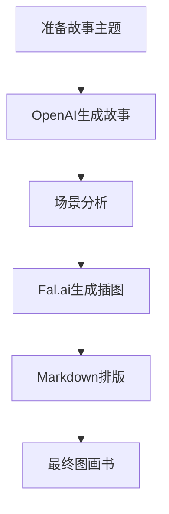

# 儿童图画书生成器 (Children's Picture Book Generator)

作者：玄清

版本号：v1.0.0 (2024.03)

这是一个使用AI技术自动生成儿童图画书的工具。它能够根据给定的主题生成故事文本，并为每个场景自动生成配套的插图。

## 项目地址

- GitHub: [Picture_book_production](https://github.com/whotto/Picture_book_production)

## 功能特点

- 自动生成儿童故事文本
- 为每个故事场景生成精美插图
- 支持多语言（中文/英文）
- 生成Markdown格式的故事文件
- 自动处理图文排版
- 支持自定义故事主题
- 智能场景分析和图像生成

## 应用场景

- 儿童教育工作者快速生成教学材料
- 家长为孩子创作个性化故事
- 出版社批量生成故事初稿
- 教育机构制作多语言儿童读物
- 创意写作教学辅助工具

## 创作流程图概览



## 使用工具及链接

- 故事生成：[OpenAI API](https://openai.com/blog/openai-api)
- 图像生成：[Fal.ai Flux](https://www.fal.ai/)
- 开发语言：[Python](https://www.python.org/)
- 文档格式：[Markdown](https://www.markdownguide.org/)

## 快速开始

1. 克隆项目到本地：
```bash
git clone https://github.com/whotto/Picture_book_production.git
cd Picture_book_production
```

2. 安装依赖：
```bash
pip install -r requirements.txt
```

3. 配置环境变量：
   - 复制 `.env.example` 为 `.env`
   - 填入您的 API 密钥和其他配置

4. 准备故事主题文件（例如：test.md）：
```markdown
# 故事主题
- 一只勇敢的小兔子
- 森林里的魔法学校
- 小猫咪的环球旅行
```

5. 运行程序：
```bash
python story_generator.py test.md
```

## 使用指南

### API配置说明

⚠️ 重要提醒：为了安全和降低费用，建议将 OpenAI API base_url 从 [https://api.openai.com](https://api.openai.com/) 替换为 [https://api.gptsapi.net](https://api.gptsapi.net/)。使用后者可以节省约50%的API调用费用。

- [API注册链接](https://bewildcard.com/i/WHVIP)

### 配置参数说明

可以在 `.env` 文件中调整以下参数：
- `OPENAI_API_KEY`: OpenAI API密钥
- `FAL_KEY`: Fal.ai API密钥
- `IMAGE_SIZE`: 图像尺寸（默认：landscape_16_9）
- `INFERENCE_STEPS`: 图像生成的推理步数（默认：30）
- `GUIDANCE_SCALE`: 图像生成的引导比例（默认：7.5）
- `SCHEDULER`: 图像生成的调度器（默认：DDIM）
- `OUTPUT_LANG`: 输出语言（支持：zh/en）

## 输出示例

生成的内容将保存在以下目录：
- 故事文件：`generated_stories/`
- 插图文件：`generated_images/`

每个故事都包含：
- Markdown格式的故事文本
- 3张高质量的场景插图
- 中英双语内容（可选）

## 未来计划

1. 支持更多AI模型和图像生成引擎
2. 添加Web界面，方便非技术用户使用
3. 增加更多故事模板和主题
4. 支持更多语言和文化背景
5. 添加故事质量评估系统
6. 集成语音生成功能
7. 开发在线协作功能

## 联系方式

- 博客：[天天悦读](https://yuedu.biz/)
- Email：[grow8org@gmail.com](mailto:grow8org@gmail.com)
- GitHub：[PDF_reflective_translator](https://github.com/whotto/PDF_reflective_translator)

## 许可证

MIT License

## 致谢

感谢以下工具和服务的支持：
- OpenAI API
- Fal.ai Flux
- Python社区
- Markdown
