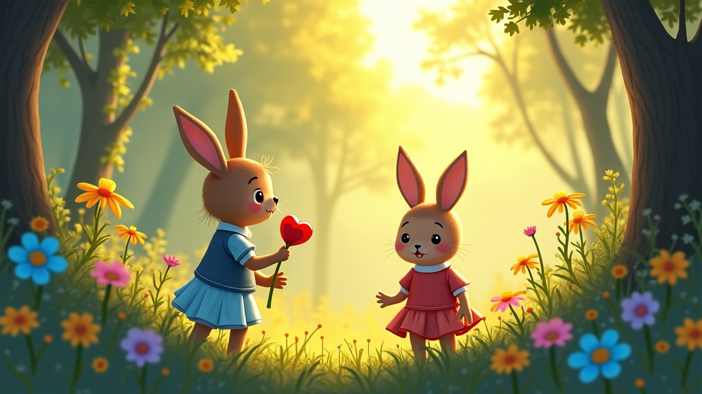
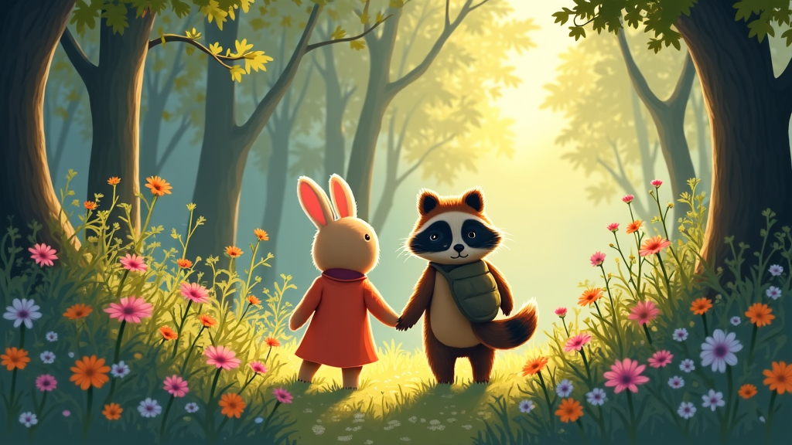
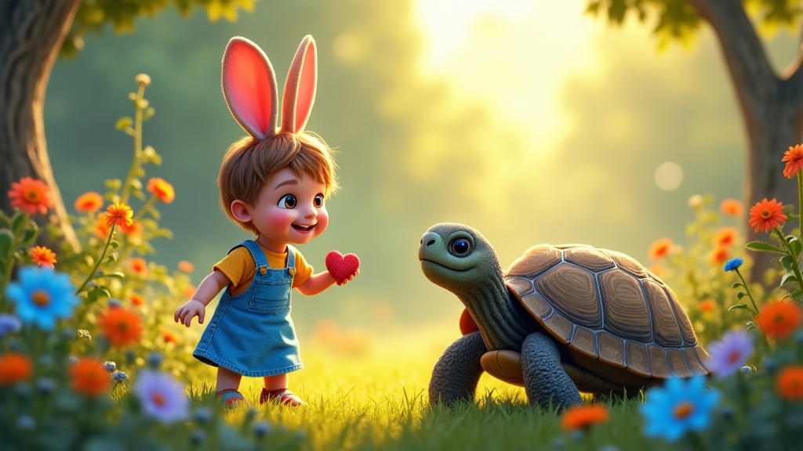

# 勇敢的小兔子莉莉

**角色：**
- **莉莉**：一只活泼、勇敢的小兔子，喜欢探索森林。
- **奥斯卡**：一只聪明、谨慎的小猫头鹰，是莉莉的朋友。

在阳光明媚的森林里，住着一只名叫莉莉的小兔子。莉莉总是对周围的世界充满好奇，总喜欢去探索新的地方。有一天，她听说森林深处有一个神秘的花园，那里盛开着五颜六色的花朵，还住着一只会说话的老龟。她决定和她的好朋友奥斯卡一起去探险，虽然奥斯卡有点担心，但他也很想看看传说中的花园。

莉莉和奥斯卡穿过了密密的树林和潺潺的小溪。一路上，他们遇到了许多可爱的动物朋友，大家都鼓励他们勇敢前行。终于，他们来到了那个神秘的花园。花园里果然开满了美丽的花朵，空气中弥漫着芬芳的香气。正当他们欣赏这些美景时，老龟慢悠悠地爬了出来，用温和的声音告诉他们，**勇气和信任是探索世界的关键**。

莉莉和奥斯卡在花园里玩了很久，他们不仅欣赏了美丽的风景，还学到了很多关于勇敢和友谊的道理。当他们告别老龟，踏上回家的路时，心中充满了自信和快乐。莉莉知道，以后无论遇到什么困难，她都会像今天一样勇敢面对。回到森林后，她把这次冒险的故事讲给其他动物听，大家都对莉莉的勇敢和智慧赞不绝口。

---

**尾注：**
- **密密的树林**：指树木生长得非常紧密的地方。
- **潺潺的小溪**：形容小溪水流动的声音。
- **芬芳的香气**：形容非常好闻的香味。
- **自信和快乐**：指有信心和开心的感觉。