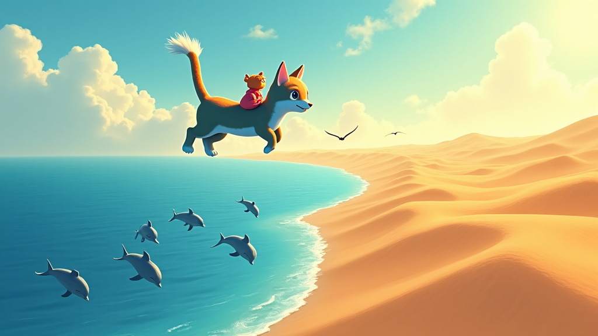

```markdown
# 小猫咪的环球旅行

**角色：**
- **小猫咪咪：** 一只勇敢又好奇的橘色小猫
- **小鸟小蓝：** 咪咪的聪明朋友，帮助它指引方向

---

在一个阳光明媚的早晨，小猫咪咪坐在窗台上，望着窗外蓝蓝的天空。它渴望去看看这个大大的世界。这时，小鸟小蓝飞来，落在咪咪的旁边。小蓝说：“咪咪，你想不想和我一起去环球旅行呢？”咪咪高兴地跳下窗台，兴奋地说：“当然想！我想去看大海、沙漠，还有高高的山峰！”于是，他们开始了奇妙的旅行。


咪咪和小蓝飞到了浩瀚无边的海洋上空。咪咪看到海豚在水中跳跃，海鸥在天空翱翔。小蓝告诉咪咪：“大海教会我们要勇敢，因为它从不害怕风暴。”接着，他们来到一片金色的沙漠，那里有一望无际的沙丘。小蓝说：“沙漠教会我们要坚韧，因为它总能在艰难的环境中生存。”咪咪点点头，心里充满了对世界的敬畏。



最后，他们抵达了一座巍峨的雪山。咪咪感受到寒风的呼啸，但它看到了那白雪皑皑的美丽景色。小蓝轻声说：“雪山教会我们要坚定，因为它总是屹立不倒。”在旅程的尽头，咪咪和小蓝回到了家。咪咪明白了，世界虽然辽阔，但每一个地方都能带给我们珍贵的教训。它心想，下次还要和小蓝一起去探索更多的地方。


---

**尾注：**
- **勇敢：** 勇敢地面对困难和挑战。
- **坚韧：** 在困难和压力下坚持不懈。
- **坚定：** 坚持信念和目标，不轻言放弃。
```