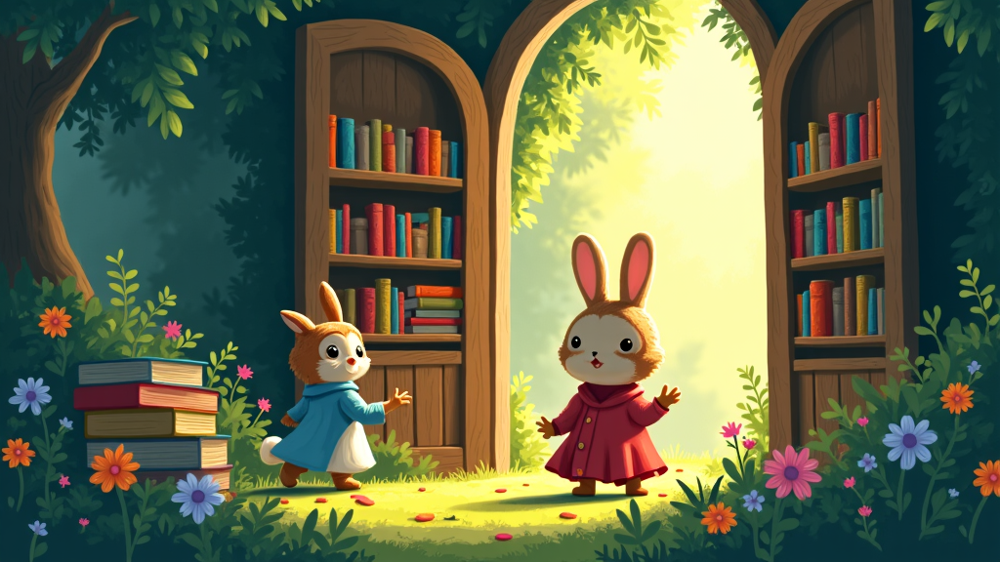

# 森林里的魔法学校

**角色：**

- 小兔子乐乐：一只活泼好动，充满好奇心的小兔子。
- 猫头鹰教授：一位智慧满满，和蔼可亲的魔法老师。

---

在一座绿意盎然的森林深处，隐藏着一所神奇的魔法学校。小兔子乐乐对魔法充满了好奇，它决定去一探究竟。乐乐轻轻地推开学校的大门，被眼前的景象惊呆了：教室里漂浮着五颜六色的书本，墙壁上长满了会唱歌的花朵。

猫头鹰教授微笑着欢迎乐乐，并告诉它，魔法是心灵的力量，需要用善良和爱心去施展。

乐乐在猫头鹰教授的带领下，开始学习魔法课程。它学会了如何用魔法帮助小动物们，比如用魔法治愈受伤的小鸟，或者用魔法种植更多美丽的花草。乐乐还认识了很多新朋友，大家一起分享快乐和知识。教授常说：“真正的魔法来自于帮助他人和珍惜自然。”乐乐牢记在心，不断进步。

一天，森林里刮起了一场大风，许多小动物的家都被吹倒了。乐乐和它的魔法同学们用所学的魔法修复家园，帮助小动物们重建家园。在这个过程中，乐乐深深体会到团结和互助的力量。风停后，森林恢复了平静，乐乐和朋友们坐在一起，仰望星空，心中充满了对未来的期待。乐乐明白，魔法不仅仅是奇迹，更是一颗关爱和帮助的心。

---

**词汇解释：**

- **团结**：团结一致，指大家共同努力，齐心协力。
- **互助**：互相帮助，指在需要时彼此给予帮助和支持。
- **施展**：发挥或展示技能或能力。